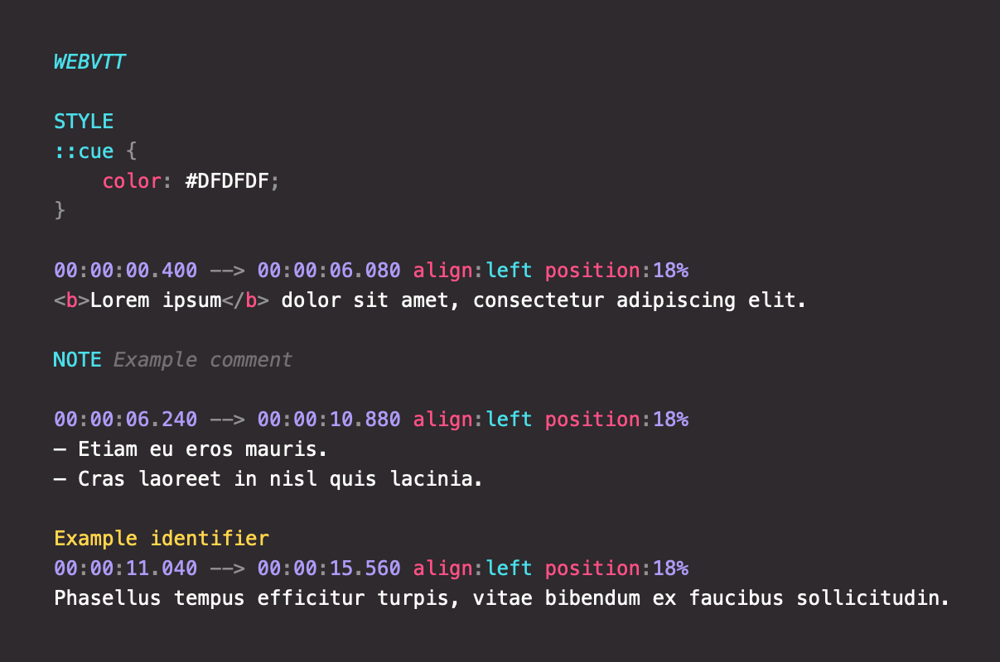

# prism-language-webvtt

WebVTT language definition for syntax highlighting of [WebVTT subtitles](https://en.wikipedia.org/wiki/WebVTT) with [Prism](https://prismjs.com).

Based on the specification from https://www.w3.org/TR/webvtt1/ and reference on https://developer.mozilla.org/en-US/docs/Web/API/WebVTT_API.

## Screenshot



## Usage

Load the language definition after Prism and define additional classes in your stylesheet if needed.

Usage with a bundler:

```console
npm install prism-language-m3u
```

```js
import Prism from "prismjs";
import "prism-language-webvtt";
```

Or the classic way:

```html
<script src="prism.js"></script>
<script src="prism-webvtt.js"></script>
```

Sample markup:

```html
<pre><code class="language-webvtt">WEBVTT

STYLE
::cue {
    color: #DFDFDF;
}

00:00:00.400 --> 00:00:06.080 align:left position:18%
<b>Lorem ipsum</b> dolor sit amet, consectetur adipiscing elit.

NOTE Example comment

00:00:06.240 --> 00:00:10.880 align:left position:18%
— Etiam eu eros mauris.
— Cras laoreet in nisl quis lacinia.

Example identifier
00:00:11.040 --> 00:00:15.560 align:left position:18%
Phasellus tempus efficitur turpis, vitae bibendum ex faucibus sollicitudin.
</code></pre>
```
